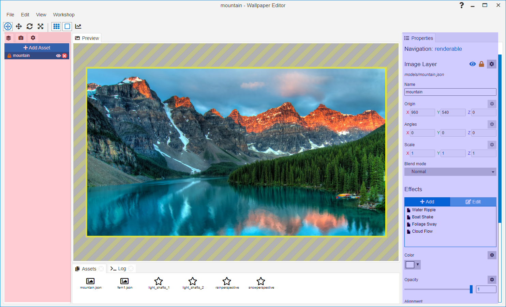

---
tags:
  - water ripples
  - foliage sway
  - water flow
  - animation
  - clouds
  - lake
  - trees
---
# Adding your first effects

In this tutorial, we will be working with an image with a lake, trees and a mountain ([Click here to download](/img/tutorials/mountain.png)) which we will use to showcase a few basic effects. 

After your image has been imported, you will be presented with the main Wallpaper Engine editor window. In this section, we will explain what **effects** are and how to apply them. Image effects can be found on the right-hand side of the editor in the properties section (**marked in blue** in the following screenshot): 

Effects are always applied to **assets**. Right now, your wallpaper only contains a single asset: The background image which you have imported.

## Animating the lake water

We will start by animating the waterfront using the **Water Ripple** effect. On the right-hand side, click on the **Add** button in the effects section. A pop-up will open from which you can see all currently installed effects. Select the **Water Ripple** effect and confirm by clicking the **OK** button.

You will immediately notice that the complete wallpaper gets a water effect applied to it which is the default behavior. In this case, we only want the water effect to be applied to the lake area of the image.

We can limit the effect to the water area of the image by painting an *Opacity Mask*. Click on the **Paint** button in the *Opacity Mask* section after adding the effect. You can start by drawing a rough outline of the lake as in the video below. The water ripples should now be limited to the area of the lake. By using the **Show Mask** option, you can view the areas you have painted the effect onto. View the following video to see these fundamental steps in action:

<video width="100%" controls loop autoplay>
  <source src="/videos/opacity_mask.mp4" type="video/mp4">
  Your browser does not support the video tag.
</video>

The first attempt will leave a lot of rough edges and the water ripples will seem unrealistically strong further away in the image. For this purpose, you can use the **Value** and **Size** sliders at the lower left corner when painting. By lowering the value, you can lower the perceived strength of the water ripples in the areas that you draw over. By setting it to 0, you can completely erase any areas that you have accidentally painted over. The mask will represent these changes in the **Value** by showing areas with lower values darker and higher values lighter.

Try to erase any unwanted areas, for example any accidentally shoreline areas, by setting the strength to 0 and gradually reduce the strength of the water ripples in the distance. This will result in a much more realistic effect rather than painting the maximum value everywhere.

Watch the following video to get an idea of what this process looks like, you may need to give it a few iterations and adjust the values until it starts looking somewhat realistic. Especially at the points of the image that are furthest away and near shorelines, try using low values below 60. Readjust the size of the paint brush to paint fine details of the image accurately.

<video width="100%" controls>
  <source src="/videos/opacity_mask_fix.mp4" type="video/mp4">
  Your browser does not support the video tag.
</video>

You can repeat this process until you have perfected the outline but often minor issues are not visible when the wallpaper is applied later, so don't worry if the opacity mask is not pixel-perfect!

## Adding a wind sway effect to the treeline

In the next step, we will add a sway effect to the treelines in the picture, imitating a wind breeze moving the trees. The most suitable effect for this is **Foliage Sway**. Return to your background layer and click on the **Add** button in the effects area like before and add the **Foliage Sway** effect.

Just as with the *Water Ripples* that we added in the previous section, the complete background layer will start swaying. Click on the **Paint** button next to the opacity mask section and start drawing over the tree areas. Similar as with the water, more far-away areas should be painted with a lower value.

In our current example, the trees furthest away on the other side of the river have a low value of 128, while the trees towards the frontside of the right-hand side of the image are painted with the max value of 255. You can also adjust the properties of the sway effect. For example, since this image is rather calm, it may make sense to reduce the **Speed** and to slightly adjust the **Direction**. These things are entirely subjective and you should just experiment to see what kind of visual changes you can achieve.

Watch the following video which shows the opacity mask that we drew and how we slightly adjust some of the properties:

<video width="100%" controls>
  <source src="/videos/sway_effect.mp4" type="video/mp4">
  Your browser does not support the video tag.
</video>

## Creating a cloud movement animation

With Wallpaper Engine, you can always experiment with alternative ways of using effects. In this section we will animate the clouds using the **Water Flow** effect. Unlike the two previous effects, this effect does not have an *Opacity Mask* but rather a *Flow Map*. The main difference is that it will not create any visible effect until you actually paint it and while painting, the direction your mouse moves actually influences the direction of the effect. The flow map represents this with different colors, as each direction will paint a different color.

Add the **Water Flow** effect to the background layer and start painting over the clouds from left to right. The clouds will start infinitely moving in the direction that your mouse took and will repeat this movement continuously. You may also notice that the cloud movement is a bit too fast with the default settings. Clouds move rather slowly, so try reducing the **Speed** property of the flow significantly to achieve a more realistic cloud movement. Just like before, you can remove the effect from any area of the image by setting the value to 0 and then painting over these specific areas of the image again.

You can watch the following video to see how the flow map is drawn and how we have reduced the speed of the effect:

<video width="100%" controls>
  <source src="/videos/cloud_effect.mp4" type="video/mp4">
  Your browser does not support the video tag.
</video>

This wraps up the basic introduction to image effects. All effects work similar to the ones presented here, you can explore effects further by reading the relevant pages of this documentation. The next section of this tutorial will introduce you to wallpaper assets.