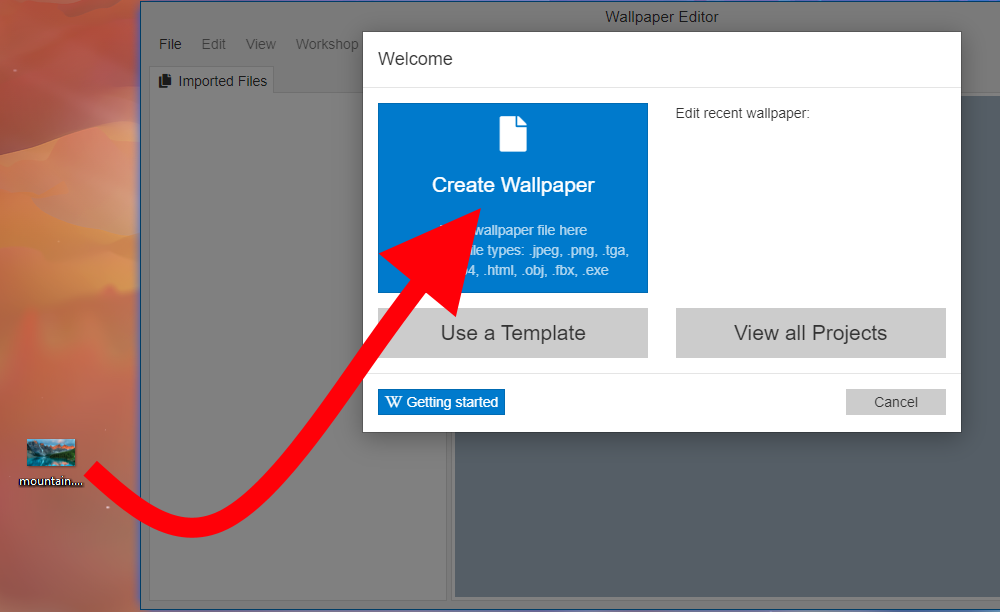

# Getting started with your first wallpaper

Welcome to the quick-start guide for the Wallpaper Engine editor! This tutorial series will lead you through the most important features of the Wallpaper Engine editor. After you are done with this tutorial, you will understand how to handle the Wallpaper Engine editor user interface, how to apply effects and add additional content to your wallpapers. You will also be able to add configurable options to your wallpaper so that users can customize and tweak your wallpaper even further.

The Wallpaper Engine editor is very powerful and caters to casual and advanced users alike. Once you have mastered the basics, you can move on to the more advanced features which are handled in other sections of the Wallpaper Engine documentation. If you ever get lost, feel free to reach out to us or the Wallpaper Engine community.

## Importing your image

Once you open the Wallpaper Engine editor, you are presented with the welcome screen of the editor. You can simply drag and drop the image you want to animate into the **Create Wallpaper** button to get started:

If you would like to follow along this tutorial, you can use the example image we will be using in the following sections by downloading it from this link (1920 x 1080 resolution): 

<a href="/img/tutorials/mountain.png" download="mountain.png">Click here to download the sample image</a>

## A foreword on wallpaper resolutions

Before you get started with any image you import, first make sure that your main background image represents a real screen resolution. The example image we use for this guide is 1920 x 1080 which is the most commonly used resolution on computer screens.

If you would like, you can read the [Project Resolution](/scene/performance/resolution) guide for a lengthier explanation before you get started with your first wallpaper and the rest of this guide.